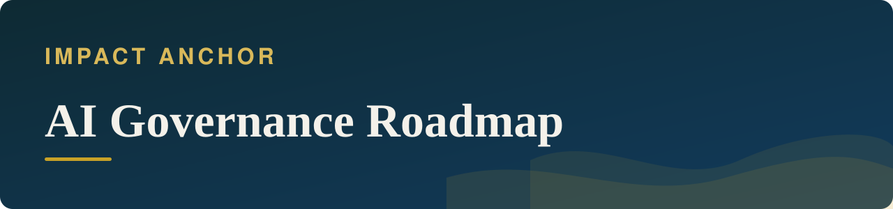
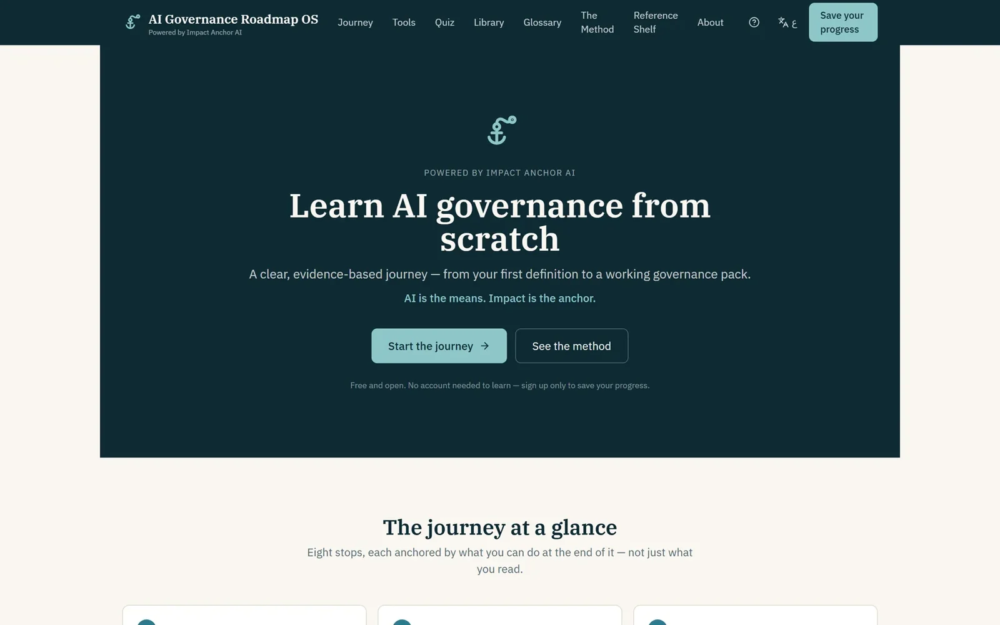
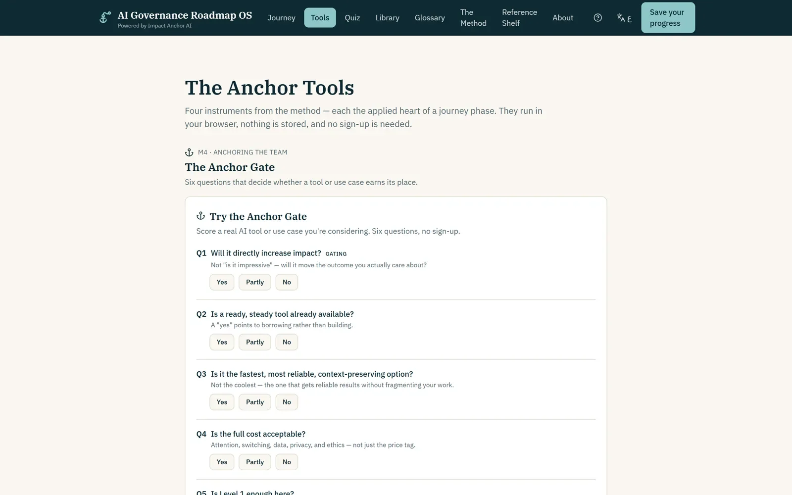

<b>Status:</b> Relaunching &nbsp;·&nbsp; <b>Built by</b> <a href="https://github.com/Mohanad1st">Mohannad Hesham</a> &nbsp;·&nbsp; <b>Source:</b> private

دورة مجانية ثنائية اللغة في حوكمة الذكاء الاصطناعي

> **This is a showcase, not the code.** The source is private because it is being relaunched. This page shows what it does and how it was built, not the code itself. A live walkthrough is available on request.

## The problem

Most AI governance material is dense, paywalled or a list of regulations to memorise. Teams in NGOs and the impact sector need judgement, not memorisation. This course turns the major frameworks — NIST AI RMF, ISO 42001, the EU AI Act, OWASP, UNESCO and OECD — into a guided journey anyone can follow for free, in English or Arabic.

## What it does

- An eight-stage guided path from first concepts to a working governance output
- A visual library of plain-language diagrams
- Four interactive tools that score a real AI use case — no sign-up needed
- An adaptive daily quiz that focuses on your weaker topics
- A regulatory timeline and a graded source list
- Gentle progress tracking, with no leaderboards

## See it

 The journey

 The Anchor Tools — run in the browser, nothing stored

All screens show demo data or public pages only.

## Built with

React · TypeScript · component design system · browser-side interactive tools · managed backend for optional accounts

## Built responsibly

- No account is needed to learn; an optional account only saves progress
- Analytics are anonymous, with an opt-out
- Arabic lesson copy is tracked as needing human review before it counts as final

## What it deliberately doesn't do

- It is not legal advice, and it is not a compliance certification.

## More from Impact Anchor

- [ImpactAnchor Reels](https://github.com/Mohanad1st/impactanchor-reels-showcase) — Recorded sessions in; scored, subtitled, scheduled short videos out
- [Impact Anchor — consulting site](https://github.com/Mohanad1st/impact-anchor-site-showcase) — From AI overwhelm to a working adoption plan, for mission-driven teams
- [Anchor Learning Hub](https://github.com/Mohanad1st/anchor-learning-hub-showcase) — Interactive, bilingual, offline-ready learning for workshops and training programmes
- [Network Intelligence](https://github.com/Mohanad1st/network-intelligence-showcase) — Relationships, opportunities and content in one self-hosted workspace

---

© 2026 Mohannad Hesham. Showcase text and images only — no source code is published or licensed here. See all my work on <a href="https://github.com/Mohanad1st">my GitHub profile</a> · <a href="https://www.linkedin.com/in/mohannadhesham/">LinkedIn</a>.
